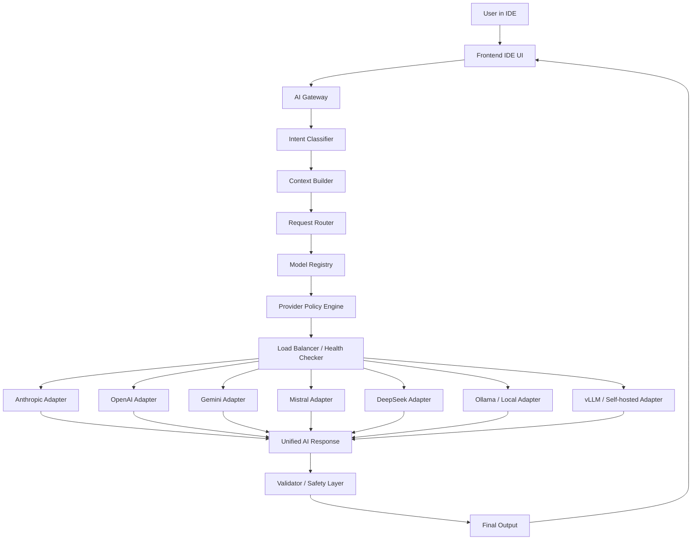

# AI Provider Architecture

This document describes the provider-agnostic AI layer for the IDE.

## Goals

- Support many providers and many models
- Route requests by task type, cost, latency, and capability
- Provide automatic fallback and load balancing
- Keep IDE UI independent from provider details
- Support both cloud and local models

## Diagram

## Request flow

1. The IDE sends a request to the AI Gateway.
2. The Intent Classifier identifies the task.
3. The Context Builder assembles repo, file, diff, and terminal context.
4. The Request Router selects a task strategy.
5. The Model Registry exposes eligible models and capabilities.
6. The Policy Engine scores candidate providers/models.
7. The Load Balancer sends the request to the best healthy adapter.
8. The provider returns a response.
9. The Validator checks safety, format, and patch quality.
10. The final answer or patch is delivered back to the IDE.

## Implementation link

See `docs/architecture/ai-provider-implementation.md` for the concrete service layout and rollout order.

## Routing signals

- Task type: chat, edit, refactor, explain, plan, validate, embed, rerank
- Capability: tools, vision, reasoning, streaming, long context
- Cost: token price, request budget
- Quality: internal eval score, user feedback, success rate
- Health: latency, error rate, quota, regional availability
- Strategy: primary, fallback, offline, local-only

## Provider interface

Each provider adapter should expose a common interface:

- `generateText`
- `streamText`
- `embedText`
- `rerank`
- `countTokens`
- `supportsTools`
- `supportsVision`
- `supportsStreaming`

## Fallback policy

- Retry once on transient failure
- Switch to secondary provider if the primary fails
- Degrade to smaller or faster model if the premium model is unavailable
- Fall back to local model when cloud providers are unavailable
- Surface a clear warning if the response quality is degraded

## Operational notes

- Track latency and error rate per provider/model
- Apply circuit breakers to unhealthy providers
- Cache embeddings and repeated prompt fragments
- Redact secrets before sending context to any model
- Record which provider/model answered each request for observability
