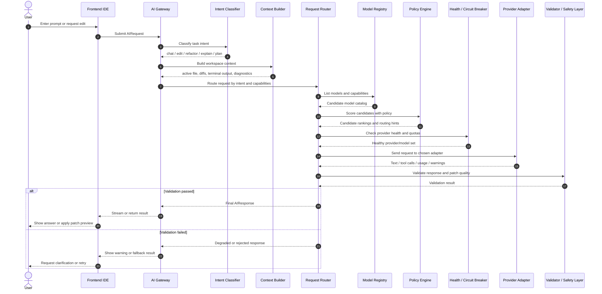

# AI Provider Sequence Diagram

## Detailed flow notes

- The router first narrows candidates by task type.
- The policy engine prefers models by score, not by fixed provider.
- The health layer removes failing or quota-limited providers.
- The adapter returns either full text or streamed deltas and tool calls.
- The validator can reject unsafe or low-quality results before the IDE shows them.
- Fallback can re-enter the routing step with a smaller or local model.
