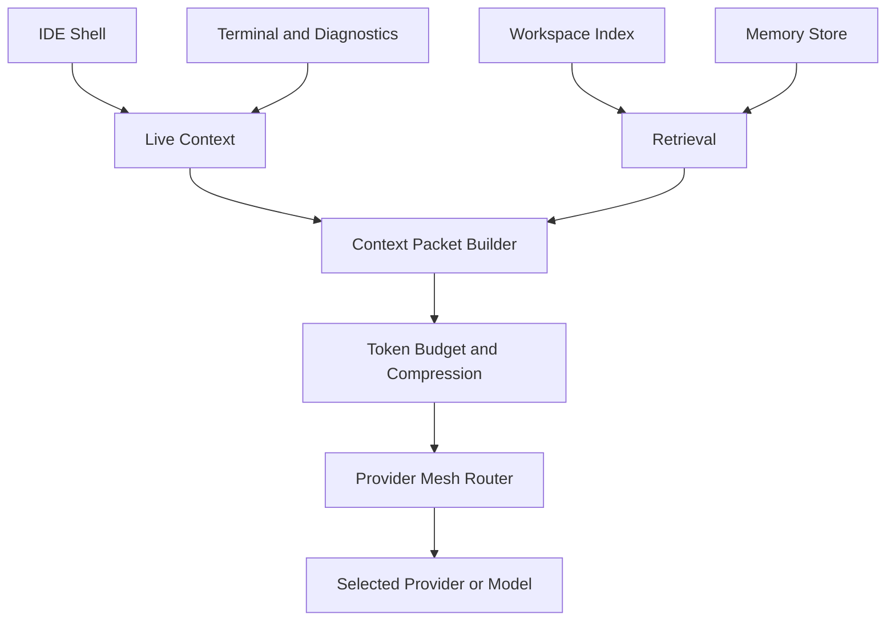

# Context Memory Orchestration

เป้าหมายของ context-memory คือทำให้ AI ภายใน IDE ไม่ลืมงาน แม้เปลี่ยน provider, เปลี่ยน model, หรือแบ่งงานให้หลาย model ช่วยกัน. Memory ต้องเป็นของ IDE ไม่ใช่ conversation history ของ provider ใด provider หนึ่ง.

> [!important]
> Provider/model ทุกตัวควรได้รับ context packet ที่สร้างจากแหล่งเดียวกัน. ห้ามให้แต่ละ provider สะสม context เองแบบแยกเกาะ เพราะจะทำให้ข้าม session และข้าม model แล้วลืมงาน.

## Memory Types

| Type | อายุข้อมูล | ใช้ทำอะไร |
| --- | --- | --- |
| Working context | ต่อ request | active file, selection, prompt, immediate diagnostics |
| Session memory | ต่อ IDE session/task | goals, decisions, files touched, unresolved questions |
| Workspace memory | ต่อ repo | architecture summary, package map, conventions, recurring pitfalls |
| Semantic memory | long-term | embeddings ของ docs/source/symbols สำหรับ retrieval |
| Episodic memory | long-term | history ของ tasks, patches, outcomes, accepted/rejected changes |
| Provider performance memory | long-term | model quality, latency, cost, failure pattern ต่อ task kind |

## Current Context Fields

`packages/protocol/src/ai.ts` มี `AIRequestContext` แล้ว:

- `workspaceId`
- `sessionId`
- `userId`
- `activeFilePath`
- `selectedText`
- `openFiles`
- `gitDiff`
- `terminalOutput`
- `diagnostics`
- `repoSummary`
- `language`
- `metadata`

ช่องเหล่านี้ดีสำหรับ MVP แต่ยังขาด persistent memory, retrieved chunks, task state, patch history, และ model handoff summary.

## Target Context Packet

ทุก provider/model ควรรับ context packet ที่ normalize แล้ว:

```ts
interface ContextPacket {
  requestId: string;
  workspaceId: string;
  sessionId: string;
  taskGoal: string;
  currentPrompt: string;
  activeFiles: Array<{ path: string; reason: string; content?: string }>;
  selectedText?: string;
  gitDiff?: string;
  diagnostics?: Array<{ source: string; message: string; severity: string }>;
  retrievedMemory: Array<{ id: string; kind: string; summary: string; source: string }>;
  decisions: string[];
  constraints: string[];
  patchHistory: Array<{ patchId: string; status: string; summary: string }>;
  handoffSummary: string;
}
```

## Context Assembly Flow



## How AI Avoids Forgetting

- ทุก task มี `sessionId` และ task state กลาง.
- ทุก provider ได้ `handoffSummary` ล่าสุดก่อนทำงาน.
- หลัง model ตอบ ต้องบันทึก outcome, decision, patch status, warnings, และ usage.
- Context curator สรุปบทสนทนาเก่าเป็น compact memory ไม่ส่ง raw history ทั้งหมด.
- Retrieval ดึงเฉพาะ memory/source chunks ที่เกี่ยวกับ task ปัจจุบัน.
- เมื่อข้าม provider ต้องส่ง same task goal, constraints, decisions, และ patch history ไปด้วย.
- เมื่อ context เกิน budget ต้อง compress เป็น summary พร้อม source references ไม่ตัดทิ้งเงียบๆ.

## Proposed Service Boundary

| Boundary | Ownership |
| --- | --- |
| `apps/web` | เก็บ live UI state, selection, active file, context chips |
| `packages/protocol` | types สำหรับ request/context/memory/result |
| `packages/ai-core` | provider-agnostic context planning, task planning, memory selection contracts |
| `packages/workspace-core` | workspace graph, file indexing, search abstractions |
| `services/model-gateway` | provider routing/execution, usage telemetry, provider performance memory |
| future memory service/package | persistent memory store, embeddings, summaries, task history |

## Memory Store Options

- MVP: JSON/SQLite store per workspace สำหรับ session memory และ patch history.
- Semantic search: vector store สำหรับ docs/source chunks เมื่อมี embedding provider พร้อม.
- Local-first: เก็บ memory ใน workspace folder หรือ app data เพื่อไม่ผูกกับ cloud provider.
- Privacy mode: tag memory ที่ห้ามส่งขึ้น cloud และบังคับ `localOnly` routing.

## MVP Implementation Steps

- เพิ่ม protocol types สำหรับ `MemoryRecord`, `ContextPacket`, `TaskState`, `ProviderUsageOutcome`.
- สร้าง context builder ใน `packages/ai-core` ที่รับ live context + memory records แล้วคืน compact context packet.
- เพิ่ม session memory store แบบ in-memory ก่อน แล้วค่อย persist.
- ผูก web chat flow ให้ส่ง `sessionId` จริงและ context chips ที่เลือก.
- บันทึก accepted/rejected patch เป็น episodic memory.
- ใช้ provider performance memory เป็น signal ใน [[provider-mesh-routing]].

## Related Notes

- [[ai-first-ide]]
- [[architecture-index]]
- [[ai-first-ide-vision|AI-First IDE Vision]]
- [[provider-mesh-routing]]
- [[web-ai-chat-flow]]
- [[patch-apply-flow]]
- [[0003-provider-mesh-and-context-memory]]
- [[implementation-checklist]]
