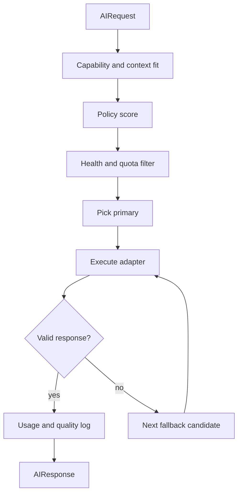

# Provider Mesh Routing

Provider mesh คือชั้นกลางที่ทำให้ IDE ใช้หลาย AI provider/model ได้เหมือนเป็นระบบเดียว. UI ส่ง `AIRequest` หนึ่งครั้ง แล้ว gateway ตัดสินใจว่าจะใช้ model ไหน, fallback อย่างไร, หรือให้หลาย model ช่วยกันในงานเดียว.

> [!note]
> โค้ดปัจจุบันมี provider mesh runtime ที่รันได้จริงแล้วใน `services/model-gateway`; note นี้ใช้ทั้งอธิบาย implementation ที่มีอยู่และ target design ที่ยังขยายต่อได้.

## Responsibilities

- เก็บ catalog ของ provider/model และ capabilities.
- ตรวจ health, latency, error rate, quota, circuit state.
- เลือก model ตาม task kind, context size, capability, cost, latency, quality score.
- ทำ fallback เมื่อ provider ล้ม, quota หมด, validation fail, หรือ model ไม่รองรับ capability.
- ทำ load balancing แบบ policy-based ไม่ใช่ hardcoded provider.
- ส่ง telemetry กลับ memory/usage layer เพื่อเรียนรู้ว่า model ไหนเหมาะกับงานแบบไหน.

## Runtime Components

| Component | Current location | Target role |
| --- | --- | --- |
| Model registry | `services/model-gateway/src/router/registry.ts` | รายการ provider/model/capabilities/cost/context limit |
| Policy engine | `services/model-gateway/src/router/policy-engine.ts` | คำนวณ score และเลือก candidate |
| Router engine | `services/model-gateway/src/router/ai-router.ts` | รวม registry, policy, health, fallback, adapter execution |
| Health check | `services/model-gateway/src/health/health-check.ts` | ตรวจ provider health และ quota |
| Circuit breaker | `services/model-gateway/src/health/circuit-breaker.ts` | ตัด provider ที่ fail ซ้ำออกชั่วคราว |
| Fallback planner | `services/model-gateway/src/router/fallback.ts` | จัดลำดับ fallback model |
| Provider adapter | `services/model-gateway/src/adapters/*` | แปลง unified request ไป provider API |
| Usage log | `services/model-gateway/src/telemetry/usage-log.ts` | บันทึก provider/model/cost/latency ต่อ request |

## Scoring Signals

- `AIRequestKind`: chat, edit, refactor, explain, plan, validate, embed, rerank.
- Capability: tools, vision, reasoning, streaming, longContext, codeEditing, embeddings, reranking.
- Context size: token budget ที่ต้องใช้กับ active file, diff, diagnostics, memory.
- Cost: input/output token price และ budget ต่อ task/session.
- Latency: p50/p95 response time ต่อ provider/model.
- Reliability: error rate, timeout rate, quota remaining, circuit state.
- Quality: eval score, user acceptance rate, patch apply success rate.
- Privacy: localOnly, cloud allowed, sensitive context redacted.

## Routing Strategies

| Strategy | ใช้เมื่อ | Behavior |
| --- | --- | --- |
| `primary` | default | เลือก best overall candidate |
| `fallback` | primary fail | ใช้ fallback chain จาก score ลำดับถัดไป |
| `localOnly` | sensitive/offline | ใช้เฉพาะ local provider เช่น Ollama/vLLM |
| `costOptimized` | งานง่ายหรือ batch | เลือก model ที่ถูกและพอความสามารถ |
| `latencyOptimized` | interactive chat/edit | เลือก model ที่ตอบเร็วและ healthy |
| `committee` | งานเสี่ยงสูง | ให้หลาย role/model ตอบแล้ว synthesize/review |

## Multi-Model Collaboration

งานใหญ่หนึ่งงานควรถูกแยกเป็น roles แทนการโยนให้ model เดียวทั้งหมด.

| Role | ตัวอย่าง model tier | หน้าที่ |
| --- | --- | --- |
| Planner | premium reasoning | แตก task, ระบุ files, กำหนด acceptance criteria |
| Context Curator | fast/embedding | ดึง context ที่เกี่ยวข้องและสรุป memory |
| Coder | balanced/premium codeEditing | สร้าง patch หรือ implementation |
| Reviewer | premium reasoning/local validate | ตรวจ bug, security, regression, missing tests |
| Verifier | fast/local | รัน validation summary และเช็ค output format |
| Synthesizer | balanced | รวมผลลัพธ์เป็นคำตอบเดียวหรือ patch plan |

Current implementation exposes this through `POST /ai/collaborate`. The model gateway builds a role plan, passes the same `ContextPacket` plus prior role outputs into each role prompt, routes every role through the provider mesh, and returns the synthesizer output as the final result.

## Load Balancing Model

## Implementation Notes

- `AIRouterEngine.route()` ตอนนี้ต่อ registry -> health -> policy -> fallback planner แล้ว.
- Runtime ตอนนี้เลือก adapter ตาม `providerId` ที่ route ได้แล้ว และใช้ provider calls จริงใน main AI flows; streaming ใช้ adapter path คู่กันใน route/controller layer.
- `/health/providers` และ `/settings/provider-status` expose runtime provider snapshot ที่อ่านได้จาก controller/router.
- Circuit breaker record success/failure จาก adapter execution แล้ว; richer quota/latency intelligence ยังขยายต่อได้.
- Usage log ตอนนี้บันทึก successful executions และ fallback-success paths; failure-side telemetry ยังเพิ่มได้อีก.
- Provider credentials ต้องอยู่ฝั่ง service layer ไม่อยู่ใน web UI.

## Related Notes

- [[ai-first-ide]]
- [[architecture-index]]
- [[ai-provider-architecture]]
- [[ai-router-provider-interfaces]]
- [[context-memory-orchestration]]
- [[0003-provider-mesh-and-context-memory]]
- [[implementation-checklist]]
