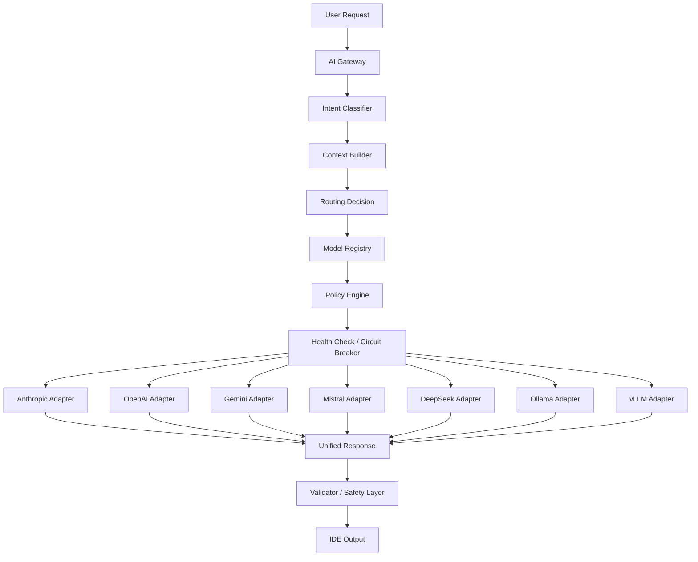

# Provider Routing Diagram

## Notes

- The router picks a candidate set from the registry.
- The policy engine scores each candidate.
- The health layer removes failing providers from selection.
- The validator checks the final output before it reaches the IDE.
