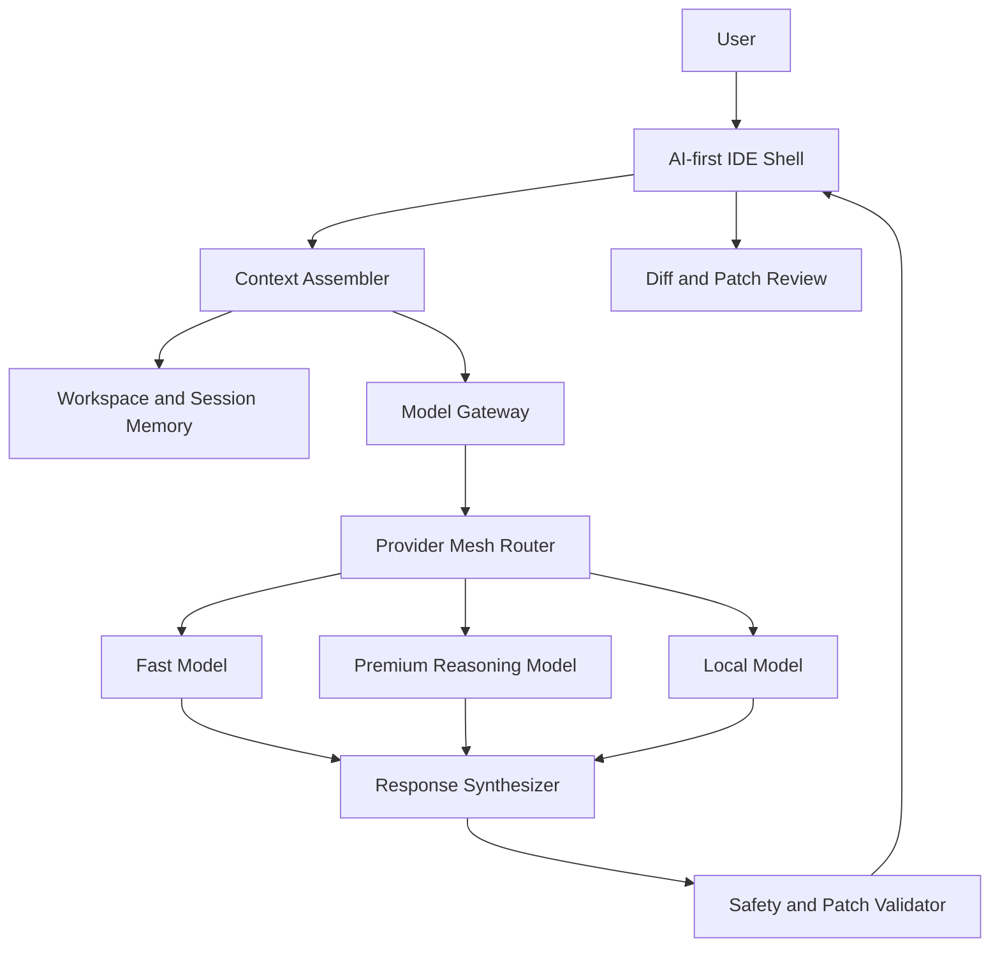

# AI-First IDE Vision

เป้าหมายคือสร้าง IDE ใช้เองที่มีแนวคิดใกล้ OpenCode และ Cursor แต่ควบคุมสถาปัตยกรรมเองทั้งหมด: editor, workspace, terminal, AI providers, model routing, memory, patch review, และ workflow สำหรับให้ AI ทำงานข้าม provider โดยไม่ลืมบริบท.

> [!important] North Star
> ผู้ใช้คุยกับ IDE หนึ่งตัว แต่เบื้องหลัง IDE เลือก provider/model ที่เหมาะกับงาน, แบ่งงานให้หลาย model ช่วยกัน, เก็บ context/memory ที่จำเป็น, และเสนอผลลัพธ์เป็น diff หรือ patch ที่ตรวจสอบได้ก่อน apply.

^north-star

## Product Promise

- IDE ต้องเป็น AI-first ไม่ใช่ editor ที่แค่แปะ chat panel เพิ่ม.
- AI ต้องเห็น context ของ workspace, active file, selected text, git diff, diagnostics, terminal output, และ task history ผ่าน context layer กลาง.
- Provider ต้องถอดเปลี่ยนได้ เช่น Anthropic, OpenAI, Gemini, Mistral, DeepSeek, Ollama, vLLM, custom local model.
- Routing ต้องเลือก model จาก capability, cost, latency, health, quota, context length, และ task kind.
- Load balancing ต้องไม่ใช่ random round-robin อย่างเดียว แต่ต้องรู้ health, failure rate, quota pressure, และ fallback tier.
- Memory ต้องแยกจาก provider เพื่อให้ session ย้ายข้าม model ได้โดยไม่ลืม context สำคัญ.
- AI edits ต้องโปร่งใสผ่าน patch card, diff, approval, reject, apply, และ rollback path ในอนาคต.

## Current Repo Reality

- Web shell อยู่ที่ `apps/web` และ boot ผ่าน `index.html` -> `src/main.tsx` -> `AppShell`.
- Web ใช้ React, TanStack Router, TanStack Query, Monaco, และมี shell แบบ VS Code ที่เปิด workspace จริง, เปิด/แก้/save ไฟล์จริง, คุยกับ AI, และรัน terminal ผ่าน gateway ได้แล้ว.
- ทุกครั้งที่เปิดหรือ reload web shell ผู้ใช้ต้องเลือก `workspaceRoot` ก่อน แล้วค่อยเข้า explorer/editor; ตัวเลือก recent workspaces ถูกเก็บฝั่ง browser.
- Shared contract อยู่ที่ `packages/protocol` และตอนนี้ครอบคลุม `ai`, `provider`, `validation`, `patch`, `settings`, และ `memory` types แล้ว.
- `services/model-gateway` เป็น runnable Fastify workspace package แล้ว มี `package.json`, `tsconfig.json`, และ `fastify` อยู่ใน workspace dependencies.
- `services/model-gateway` ตอนนี้ wire AI routes, workspace routes, settings routes, patch routes, session routes, และ terminal routes เข้ากับ provider mesh, workspace index, local-first settings, file-backed patch store, และ PTY-backed terminal runtime จริง.
- Gateway ยังถือ active `workspaceRoot` ได้ทีละค่าเดียวต่อ process; การสลับ workspace ผ่าน `/workspace/index` จะเปลี่ยน root กลางของ explorer, patch writer, และ terminal พร้อมกัน.
- `apps/desktop`, `apps/api`, `apps/worker`, `services/workspace-host`, `services/collaboration` ยังเป็น placeholder.

ดูรายละเอียด gap ใน [[current-state-gap-analysis]].

## Target User Flow

## Main Capabilities

- Chat with workspace-aware context.
- Ask for edit/refactor/explain/plan/validate tasks using `AIRequestKind` from [[ai-router-provider-interfaces]].
- Stream responses and tool calls back to the UI.
- Convert tool calls into reviewable patch cards.
- Route each task to the best provider/model via [[provider-mesh-routing]].
- Let multiple models collaborate on one task without losing context via [[context-memory-orchestration]].
- Track usage, cost, latency, failures, and selected model for every request.

## Non-Goals For MVP

- ไม่ต้องสร้างทุก provider พร้อมกัน.
- ไม่ต้องทำ full desktop shell ก่อน web shell เสถียร.
- ไม่ต้องให้ AI apply file โดยตรงแบบไม่ผ่าน review.
- ไม่ต้องสร้าง distributed collaboration ก่อน context/memory และ model gateway ทำงานจริง.

## Design Principles

- UI ไม่รู้ provider key และไม่เรียก provider ตรง.
- Provider-specific code อยู่หลัง adapter contract ใน `services/model-gateway`.
- Memory/context เป็นของ IDE ไม่ใช่ของ provider ใด provider หนึ่ง.
- Protocol types ต้องเป็น source of truth สำหรับ apps และ services.
- ทุก AI action ที่แก้ไฟล์ต้องตรวจสอบย้อนหลังได้.

## Related Notes

- [[ai-first-ide]]
- [[current-state-gap-analysis]]
- [[provider-mesh-routing]]
- [[context-memory-orchestration]]
- [[ai-first-ide-roadmap]]
- [[0003-provider-mesh-and-context-memory]]
